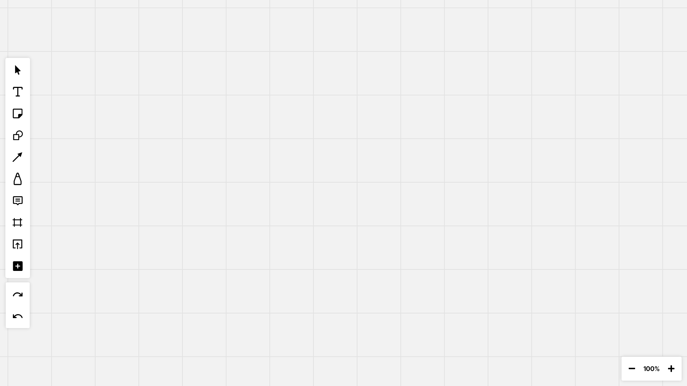

# Layer

Technologies use hoongi app ko bana ne ke liyea `react`, `typescript`, `tailwindcss`

Kaam teeno me divided hai: `Rishab`, `Mehul`, `Ebad`

`Ebad` ka kaam pehla hai ki us ko app ka ui desgin bana na hai.
<br />
Aur jaise jaise design hota hai toh usko ko code krne ka kaam hai `Mehul`, `Rishab`, `Ebad` ka.

**Note ki baat:** Extra info ke liyea 👉[Layer - React TS Project](https://www.notion.so/Miro-Clone-React-TS-Project-032699dc9c1d4980a7b2b733024e6ce7?pvs=4)👈 me hai

> Rishab ko toolbar ke design ko code krna hai, aur desgin is me hai 👉[./design/tool-bar-design.png](./design/tool-bar-design.png)👈.

### Design



> Code kr ne pehle ek branch bana na `create-tool-bar` niche wali commands se.

```
git branch create-tool-bar
git checkout create-tool-bar
```

Tool bar desgin must be coded inside the [Toolbar.tsx](./src/components/Toolbar.tsx) Component.
<br />
All the icons are located inside [public/icon](./public/icons/) folder.
